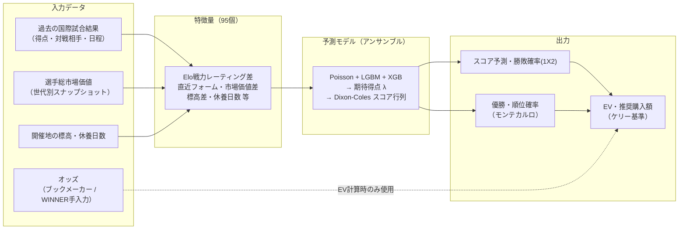
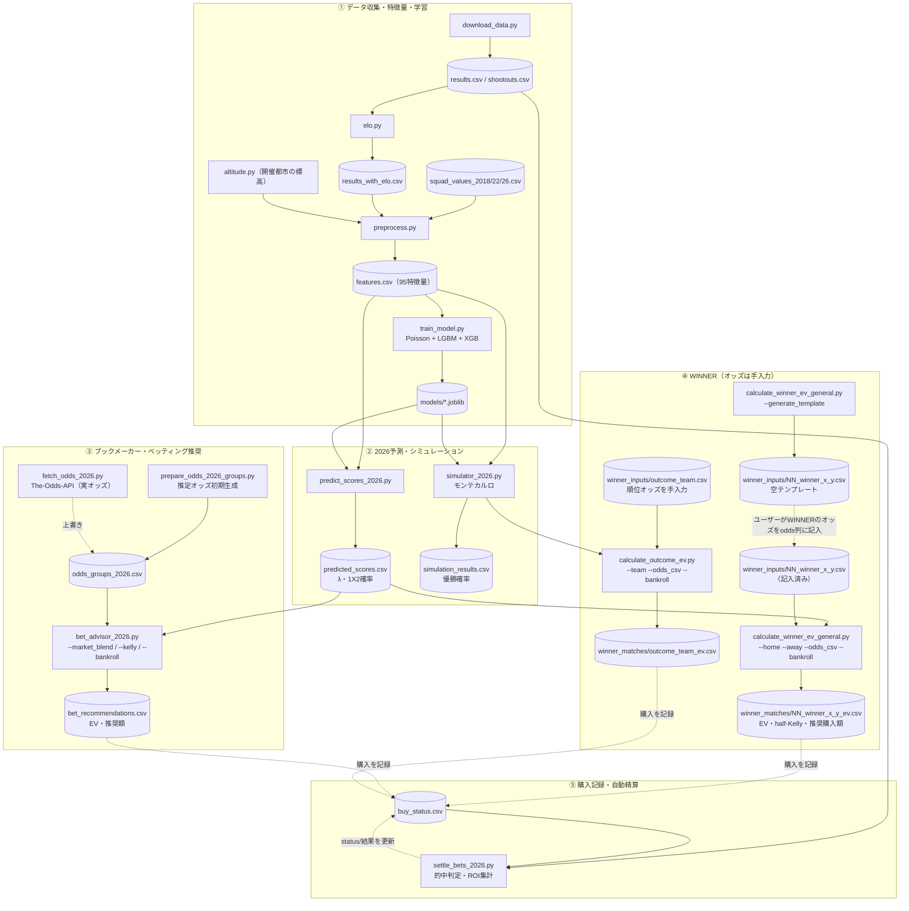

# サッカー国際試合 予測モデル・シミュレータ

本プロジェクトは、過去の国際Aマッチ結果を用いて国ごとの実力を評価するモデルを構築し、FIFAワールドカップをテストデータとしたバックテスト評価、大会全体のモンテカルロ・シミュレーション（優勝確率算出）、および2026年大会のリアルタイム予測・ベッティング推奨を行う総合システムです。

---

## 開発環境とセットアップ

本プロジェクトは以下の環境で動作確認・構築されています。

* **Pythonバージョン:** `3.10.19`
* **ハードウェア要件:** GPU不要（標準的なマルチコアCPUのみの環境で十分に高速動作します）
* **主要な依存ライブラリとバージョン:**
  * `pandas` == `2.3.3`
  * `numpy` == `2.2.5`
  * `scikit-learn` == `1.7.2`
  * `lightgbm` == `4.6.0`
  * `optuna` == `4.9.0`
  * `scipy` == `1.15.3`
  * `joblib` == `1.5.3`
  * `requests` == `2.32.5`
  * `sqlalchemy` == `2.0.50`
  * `beautifulsoup4` == `4.14.3`

### 💻 環境の構築・再現手順

リポジトリ直下にある [environment.yml](./environment.yml) を使用して、Conda環境を簡単に再現できます。

**1. Conda環境の新規作成:**
```bash
conda env create -f environment.yml -n wcup_winner
# macOS (Apple Silicon/Intel) で lightgbm が libomp.dylib エラーになる場合:
conda install -n wcup_winner -c conda-forge llvm-openmp -y
```

**2. 環境のアクティベート:**
```bash
conda activate wcup_winner
```

**3. （参考）既存環境への一括インストール:**
既存の環境にライブラリのみをインストールする場合は、以下を実行してください。
```bash
pip install pandas==2.3.3 numpy==2.2.5 scikit-learn==1.7.2 lightgbm==4.6.0 optuna==4.9.0 scipy==1.15.3 joblib==1.5.3 requests==2.32.5 sqlalchemy==2.0.50 beautifulsoup4==4.14.3
```

---

## ファイル構成

```text
wcup_winner/
├── README.md
├── src/
│   ├── pipeline/                      # コアパイプライン（データ収集〜学習）
│   │   ├── download_data.py           # 国際Aマッチデータの自動収集
│   │   ├── elo.py                     # 全試合からElo Ratingを時系列算出
│   │   ├── preprocess.py              # 市場価値結合・Elo調整rolling特徴量の生成
│   │   └── train_model.py             # Poisson + LightGBM(Optuna) アンサンブルモデル学習
│   ├── odds/                          # オッズデータ準備
│   │   ├── prepare_odds.py            # 2022年カタールW杯オッズ
│   │   ├── prepare_odds_2018.py       # 2018年ロシアW杯オッズ（全64試合手動定義）
│   │   ├── prepare_odds_2026_groups.py# 2026年グループステージオッズ（実値+推定値）
│   │   └── fetch_odds_2026.py         # The-Odds-APIによる実オッズの自動取得
│   ├── backtest/                      # バックテスト・検証
│   │   ├── backtest.py                # --year 2018/2022 で大会切替
│   │   └── walkforward.py             # 時系列ウォークフォワード検証・パラメータ調整
│   └── predict/                       # 予測・シミュレーション・推奨
│       ├── simulator.py               # 2022年大会 32カ国モンテカルロ
│       ├── simulator_2026.py          # 2026年大会 48カ国対応モンテカルロ
│       ├── predict_scores_2026.py     # 全72試合 スコア予測・勝敗確率出力
│       ├── bet_advisor_2026.py        # EV計算・ケリー基準ベッティング推奨
│       ├── calculate_winner_ev_general.py # WINNER 18択期待値計算 (汎用ツール)
│       ├── calculate_outcome_ev.py    # WINNER チーム成績予想（順位/優勝など）の期待値計算
│       └── settle_bets_2026.py        # WINNER 自動精算・ROI集計ツール
├── data/
│   ├── buy_status.csv                 # WINNER 購入履歴・結果ステータス管理
│   ├── raw/
│   │   ├── match/                     # 試合結果データ
│   │   │   ├── results.csv            # 全国際Aマッチ結果（download_data.pyで随時更新）
│   │   │   └── shootouts.csv          # PK戦結果
│   │   ├── odds/                      # オッズデータ
│   │   │   ├── odds_qatar2022.csv
│   │   │   ├── odds_russia2018.csv
│   │   │   ├── odds_groups_2026.csv   # ★試合前に fetch_odds_2026.py で実オッズに更新
│   │   │   └── winner_inputs/         # WINNER 18択・チーム成績予想オッズの手入力CSV
│   │   └── squad/                     # 選手総市場価値データ（大会世代別）
│   │       ├── squad_values_2018.csv
│   │       ├── squad_values_2022.csv
│   │       ├── squad_values_2026.csv
│   │       └── squad_penalties_2026.csv # ★主力離脱時に team,multiplier,reason を記入（例: 0.85）
│   └── processed/
│       ├── features.csv               # 特徴量（全大会共通）
│       ├── results_with_elo.csv       # Elo付き試合結果
│       ├── 2018/                      # 2018年大会出力
│       │   ├── backtest_results.csv
│       │   ├── backtest_metrics.csv
│       │   └── roi_summary.csv
│       ├── 2022/                      # 2022年大会出力
│       │   ├── backtest_results.csv
│       │   ├── backtest_metrics.csv
│       │   ├── roi_summary.csv
│       │   └── simulation_results.csv
│       └── 2026/                      # 2026年大会出力
│           ├── simulation_results.csv
│           ├── predicted_scores.csv
│           ├── bet_recommendations.csv
│           └── winner_matches/        # WINNER個別試合・チーム成績予想の期待値CSV（自動作成）
└── models/
    ├── poisson_model.joblib
    ├── lgbm_model.joblib
    ├── lgbm_classifier_model.joblib
    └── feature_cols.joblib
```


---

## 実行手順

### 基本パイプライン（データ更新 → 学習 → 予測）

```bash
# 1. データ収集（最新の試合結果を取得）
python src/download_data.py

# 2. Elo Rating の時系列計算
python src/elo.py

# 3. 特徴量の生成
python src/preprocess.py

# 4. 予測モデルの学習・保存（Poisson + LightGBM, Optunaチューニング）
# 本番用: 全データで学習 → models/ に保存（デフォルト）
python src/pipeline/train_model.py
# バックテスト用: 大会開幕前まで学習し専用ディレクトリに保存（本番モデルと共存できる）
python src/pipeline/train_model.py --train_end 2018-06-14 --model_dir models/backtest_2018
python src/pipeline/train_model.py --train_end 2022-11-20 --model_dir models/backtest_2022
```

### バックテスト（2018年 / 2022年大会）

バックテストは `models/backtest_{year}/` が存在すれば自動でそれを使用します（リーク防止）。
無い場合は本番モデルにフォールバックし、警告を表示します。

```bash
# 2022年カタール大会
python src/odds/prepare_odds.py
python src/backtest/backtest.py --year 2022

# 2018年ロシア大会
python src/odds/prepare_odds_2018.py
python src/backtest/backtest.py --year 2018
```

### ウォークフォワード検証（パラメータ調整）

W杯2大会(128試合)では差が小さいパラメータはノイズに埋もれるため、
全国際試合で「その年より前のデータで学習 → その年を予測」を繰り返して大サンプルで評価します。

```bash
python src/backtest/walkforward.py --mode probs   # Dixon-Coles ρ × 分類器ブレンド比
python src/backtest/walkforward.py --mode shrink  # 市場シュリンク比（probsの後に実行）
python src/backtest/walkforward.py --mode elo     # Elo Kスケール × ホーム補正
```

### 2026年大会 予測・シミュレーション

```bash
# グループステージ全72試合のスコア予測（1X2確率は Poisson行列×分類器のブレンド, --cls_blend で調整可）
python src/predict/predict_scores_2026.py

# 48カ国 優勝確率シミュレーション（1万回モンテカルロ）
python src/predict/simulator_2026.py

# ベッティング推奨（EV・ケリー計算）
python src/odds/prepare_odds_2026_groups.py # 推定オッズCSVの初期生成
python src/odds/fetch_odds_2026.py          # APIから最新の実オッズをダウンロードして更新
# --market_blend: モデル確率を市場確率へシュリンクする比率（EV過大評価の抑制, default 0.3）
# --max_ev: サニティ上限。超過分はデータ異常の疑いとして警告・除外（default 2.0）
python src/predict/bet_advisor_2026.py --ev_thresh 1.05 --kelly half --bankroll 100

# WINNERの個別試合 18択期待値の計算
# (1) オッズ入力用テンプレートの生成（初回のみ。生成したCSVのodds列にWINNERのオッズを記入する）
python src/predict/calculate_winner_ev_general.py --generate_template data/raw/odds/winner_inputs/03_winner_xxx_yyy.csv
# (2) CSV入力で計算 → data/processed/2026/winner_matches/<連番>_winner_<home>_<away>_ev.csv に出力
python src/predict/calculate_winner_ev_general.py --home Mexico --away "South Africa" \
    --odds_csv data/raw/odds/winner_inputs/01_winner_mexico_south_africa.csv
# (3) または対話型でオッズを直接入力
python src/predict/calculate_winner_ev_general.py --home Mexico --away "South Africa"
# ※ λ（期待得点）は predicted_scores.csv から読むため、モデル更新後は predict_scores_2026.py を先に実行すること

# WINNERの「チーム成績予想」期待値計算（任意。モンテカルロでGS敗退(勝ち点別)〜優勝までの確率を推定）
# オッズCSVは selection_key,selection_name,odds の3列
# （selection_key: GS0-GS6 / R32 / R16 / QF / 4th / 3rd / 2nd / Champion）
# → data/processed/2026/winner_matches/outcome_<team>_ev.csv に出力
python src/predict/calculate_outcome_ev.py --team Japan --odds_csv data/raw/odds/winner_inputs/outcome_japan.csv
# 優勝予想（全チーム横断のオッズ表）はチーム別シミュレーションより
# simulation_results.csv の優勝確率列とオッズを直接突き合わせる方が効率的（outcome_champion_ev.csv はこの方式）

# WINNER購入結果の自動精算・ROI集計
python src/predict/settle_bets_2026.py
```

---

## 処理・データフロー

### 全体概要（入力 → モデル → 出力）



> ポイント1: **Eloはモデルではなく「戦力レーティング（スコア）」**。過去の試合結果から時系列で
> 算出され、その差 `elo_diff` を**特徴量**としてアンサンブルに入力する（予測器は Poisson/LGBM/XGB）。
>
> ポイント2: **オッズはモデルの確率推定には一切使わない**。モデルは試合データだけから確率を出し、
> オッズは最後の「EV＝確率×オッズ」の段階でのみ突き合わせる（だから市場の歪みを抽出できる）。

### 詳細フロー（パイプライン全体）



> 大会中は ① の `download_data → elo → preprocess` を回して最新結果を反映し、
> ②③④ を再実行すると予測・EV・推奨額が更新される（[データ更新フロー](#データ更新フロー大会中) 参照）。

### WINNER オッズの取り入れ方（手入力フロー）

WINNER のオッズは API では取得できない（日本国内くじのため）ので、**手入力**でモデルに取り込む。
モデルが出すのは「確率（λ由来）」だけで、**オッズは人間が WINNER の販売画面から CSV に転記**し、
スクリプトが「確率 × オッズ」で EV と推奨購入額を計算する、という分業になっている。

**個別試合（18択：スコア＋「その他」）の場合**

1. **テンプレート生成**（初回のみ）
   `calculate_winner_ev_general.py --generate_template data/raw/odds/winner_inputs/NN_winner_x_y.csv`
   → `selection_key, selection_name, odds` の3列を持つ空CSVが生成される
2. **オッズを手入力** — 生成された CSV の `odds` 列に、WINNER の各選択肢のオッズを転記する
   （例: `H_1-0,ホーム 1-0,10.6` / `away_other,アウェイ その他(4得点以上),5.3`）
3. **EV 計算** — `calculate_winner_ev_general.py --home X --away Y --odds_csv …/NN_winner_x_y.csv --bankroll 60000`
   → `predicted_scores.csv` から λ を読み、Dixon-Coles 行列で各スコアの確率を出し、手入力オッズと
   突き合わせて `winner_matches/NN_winner_x_y_ev.csv`（EV・half-Kelly・推奨購入額）を出力する
   ※ モデルを更新したら、先に `predict_scores_2026.py` を実行して λ を最新化すること

**チーム成績予想（順位：GS敗退〜優勝）の場合**

1. `winner_inputs/outcome_team.csv` に `selection_key, selection_name, odds`（順位オッズ）を手入力
   （`selection_key`: GS0–GS6 / R32 / R16 / QF / 4th / 3rd / 2nd / Champion）
2. `calculate_outcome_ev.py --team Japan --odds_csv …/outcome_team.csv --bankroll 60000`
   → `simulator_2026` のモンテカルロで各順位の確率を推定し、手入力オッズと突き合わせて
   `winner_matches/outcome_team_ev.csv` を出力する

**購入と精算** — 実際に購入したら `buy_status.csv` に1行記録し、`settle_bets_2026.py` が
`results.csv` の最新結果と突合して的中判定・ROI を自動更新する。

> ブックメーカー側（③）との違いは「オッズの入手元」だけ。③は The-Odds-API から実オッズを
> 自動取得（`odds_groups_2026.csv`）、④の WINNER は手入力（`winner_inputs/`）。確率の出どころ
> （モデルの λ・モンテカルロ）と EV・ケリーの計算ロジックは共通している。

### WINNER オッズ画像から EV を算出する AI 向けプロンプト

WINNER の購入画面スクリーンショットを渡すと、AI が自動でオッズを読み取り EV・推奨購入額まで
出すための指示テンプレート。リポジトリにアクセスできる AI（Claude Code 等）にそのまま渡す。

```text
あなたは本リポジトリ(wcup_winner)のWINNERベッティング補助AIです。
WINNERの試合別オッズ画面のスクリーンショットを渡すので、以下の手順でEVと推奨購入額を算出してください。

【入力】WINNER個別試合の18択オッズ画面（ホーム/引分/アウェイ別のスコア別オッズ）。
        バンクロール(総資金)は ¥60000 とする（指定があれば従う）。

【手順】
1. 画像から対戦カード(HOME/AWAY)とキックオフ日時、18択すべてのオッズを読み取る。
   18択 = ホーム[1-0,2-0,2-1,3-0,3-1,3-2,その他(4得点以上)] / 引分[0-0,1-1,2-2,その他(3得点以上)]
        / アウェイ[0-1,0-2,1-2,0-3,1-3,2-3,その他(4得点以上)]。
2. 入力CSVを data/raw/odds/winner_inputs/<連番>_winner_<home>_<away>.csv に作成する。
   列は selection_key,selection_name,odds。selection_key は固定で
   H_1-0,H_2-0,H_2-1,H_3-0,H_3-1,H_3-2,H_other,
   D_0-0,D_1-1,D_2-2,D_other,
   A_0-1,A_0-2,A_1-2,A_0-3,A_1-3,A_2-3,A_other（テンプレは --generate_template で生成可）。
3. 次を実行（Pythonは conda環境 wcup_winner: /opt/anaconda3/envs/wcup_winner/bin/python）:
     python src/predict/calculate_winner_ev_general.py --home "<Home>" --away "<Away>" \
       --odds_csv data/raw/odds/winner_inputs/<file>.csv --bankroll 60000
   ※チーム名は predicted_scores.csv の表記に合わせる（例: "Bosnia and Herzegovina"）。
     データ内で home/away が逆登録でもスクリプトが自動反転してλを読む。
   ※モデル更新後やラウンド進行後は、先に
     download_data→elo→preprocess→predict_scores_2026 を回して λ を最新化すること
     （第2節以降の試合は各チームの直前節消化後に更新したλで評価する）。

【判定ルール（規律）】
- EV>=1.10 を推奨ライン、EV<1.05 は見送り、その間は薄いので原則見送り。
- オッズ15倍以上(的中率<7%)はクォーターケリー、それ未満はハーフケリー。
- EV>2.0 はサニティ上限超え→原則除外。ただし「珍しい裾(的中率<10%)」は誤検知が濃いので除外、
  「高頻度(的中率>15%)で内部整合する大勝」は本物の可能性があるので額をキャップして可。
- 同一試合内の複数スコアは排他。個別ケリーを合算しない。最良1点に集中するか、同じ筋の上位2-3に
  「1試合の合計を1つの賭けとして」抑えて配分する。別試合どうしは独立なので各々張ってよい。
- 同時露出(結果待ちの合計額)はバンクロールの2〜3割以内に収める。
- 妙味の出やすい型: 「格上だが圧倒的でない×相手が弱く大勝もある×群衆がその大勝の裾を高オッズで放置」
  =「格上 その他(4得点以上)」。逆に大本命すぎる試合は4+が人気で潰れ妙味なし。0-0は守備的・拮抗試合のみ。
- 日本戦は応援バイアスで日本勝利が過小配当→妙味は相手勝利/引分側にのみ出やすい。

【パリミュチュエル(重要)】
- WINNERの払戻は締め切り後に確定する最終オッズ。表示オッズは暫定で、妙味の選択肢ほど締め切りに
  向けて下がる(実例: Portugal 1-1 が表示12.2→最終9.1でEV1.35→1.00)。
- よって判定は「締め切り直前のオッズ」で行うのが正確。早く買う利点はない(払戻は最終オッズ共通)。
- 前日23:30など早めに買う場合は表示EV>=1.45を要求(下落で1.10を死守)。EV1.0〜1.2の薄いものは早張り厳禁。

【出力】対戦カード・モデル予測(λ, 1X2%)、EV>=1.0の選択肢の表(オッズ/確率/EV/推奨額)、
       規律適用後の推奨ベット(額つき)、見送り判断とその理由、を簡潔に。
       購入したら buy_status.csv に1行記録し、結果確定後は最終オッズで result_amount を精算する。
```

---

## モデルアーキテクチャ

### 予測モデル（アンサンブル）

| モデル | 手法 | 役割 |
|:---|:---|:---|
| Poisson Regression | Ridge正則化 Poisson | 期待得点（λ）の線形推定 |
| LightGBM (Regressor) | Poisson目的関数 + Optuna CV最適化 | 非線形特徴量から期待得点を推定 |
| LightGBM (Regressor, チームID入り) | 上記＋チームIDカテゴリカル | チーム固有の癖を捉える簡易埋め込み |
| LightGBM (Classifier) | 3クラス分類 (H/D/A) | 勝敗確率の直接推定 |
| XGBoost (Classifier) | multi:softprob | 異種GBMによる分類の分散低減 |
| **期待得点 Ensemble** | (Poisson + LGBM + LGBMチームID) / 3 | 安定した期待得点を出力 |
| **1X2確率 Blend** | 0.75×Dixon-Coles行列 + 0.25×分類器平均(LGBM+XGB) | 最終的な勝敗確率（バックテスト・2026年予測で共通） |

> ブレンド比0.25とDixon-Coles ρ=-0.09 は、ウォークフォワード検証（2019〜2026年の全国際試合 7,183試合で
> 「その年より前のデータのみで学習→その年を予測」）のLog Loss最小値（`--cls_blend` で変更可）。
> ベッティング推奨時はさらに、マージン除去済みの市場インプライド確率と混合（`--market_blend`, デフォルト0.5）してEVの過大評価を抑制する。

### モンテカルロ・シミュレーション（2026年）

- **FIFA公式ノックアウトブラケット**を実装（R32の16試合スロット＋ベスト3位の許容グループ制約を
  バックトラッキングで充足。全495通りの3位組み合わせで検証済み）
- グループ順位の同点処理は 勝点→得失点差→総得点→**直接対決**（FIFA規則準拠）
- ノックアウトの同点時は **延長戦（λ×1/3のPoisson）→ PK戦（50/50）** で決着
- 開催国（米加墨）の自国開催試合には `was_home=1` を適用
- グループステージは**実開催都市の標高・実日程の休養日数**で試合別に予測
  （チーム状態は大会中の消化試合を含む最新時点を常に参照）
- Elo の K値はウォークフォワード評価により旧値×1.2 に調整（ホーム補正は+100を維持）

### 検証済みの不採用施策・今後の拡張

- **時間減衰サンプル重み**: walkforwardで半減期3年/5年を検証したが等重みに勝てず不採用
  （`train_model.py --half_life` で再検証可能）
- **チーム攻守GLM（Dixon-Coles型レーティング）**: λアンサンブルに加えると悪化したため不採用
  （実装は `src/pipeline/team_glm.py` に保持。`walkforward.py --mode ensemble` で再検証可能）
- **XGBoost回帰（λ側）**: 追加効果なしで不採用（分類器側のみ採用）
- **二変量Poisson行列**: 1X2はわずかに改善するがスコア市場（WINNER）の精度が悪化するため不採用
  （`walkforward.py --mode matrix` で再検証可能）
- **スタッキング・メタ学習器**: 固定ブレンドに勝てず不採用（`--mode stack` で再検証可能）
- **pi-ratings（Constantinou & Fenton 2013）**: ホーム/アウェイ別の動的レーティングから
  試合前の期待得失点差を算出する手法。先行研究（2023 Soccer Prediction Challenge 等）で
  1X2・正確スコアの上位特徴量とされるため、λアンサンブルの**追加成分**として検証した
  （2026-06-13。Eloとの差し替えではなく併用）。全国際試合のみから計算でき MLモデル再学習が
  不要な点を活かし、`walkforward_predictions.csv` にマージして評価。
  結果: λ=(1-w)·(Poisson+LGBM) + w·pi の重み掃引で、**w≈0.10 のとき全評価8,112試合の
  Log Loss が 0.86305→0.86222 と小幅改善（Brierも改善）する一方、W杯128試合の Log Loss は
  1.00646→1.00645 とほぼ不変**だった（等分1/3はpiを混ぜ過ぎてW杯を悪化させる）。
  GLM/XGB回帰/チームIDと異なり「ベースラインを改善しW杯を悪化させない」初の追加成分だが、
  改善幅は約0.1%と小さく、賭け対象のW杯では測定可能な利益が出ない（128試合では差を検出できない）
  ため、**本番には組み込まず検証済みに留める**。実装は `src/pipeline/pi_ratings.py`（中立地対応版
  あり）と `src/backtest/eval_pi_ratings.py` に保持し、再検証可能。
  （本評価の土台は P+L のみで、本番λアンサンブルの LGBM-cat 成分は未考慮。本採用検討時は
  cat 込みで再評価のこと）
- **確率較正（Post-hoc Calibration）**: 最終ブレンド1X2確率に温度スケーリング／ベクトル（行列）
  スケーリングを年次ウォークフォワード（その年より前で較正パラメータを学習→その年に適用）で
  検証したが、**いずれも逆効果で不採用**（2026-06-13検証）。較正前の時点で
  Log Loss 0.85857 / ECE 0.0123 と既に良較正であり、クラス別の平均予測と実頻度も
  予測[H 0.4725 / D 0.2307 / A 0.2925] ≒ 実績[H 0.4766 / D 0.2309 / A 0.2925]
  と引き分けバイアスを含めほぼ一致していた。`cls_blend`・市場シュリンクを Log Loss で
  最適化済みのため最終確率が既に較正されているのは整合的。
  （再検証は `walkforward_predictions.csv` の出力に scaling を適用して評価できる）
- **xG（期待ゴール）**: StatsBombオープンデータ（2018・2022年W杯128試合）での検証で、
  「過去のxG平均」は「過去の得点平均」より次戦の得点予測力が高い（失点側は相関+0.017→+0.125）
  ことを確認済み。全国際試合の継続的なxGソースを確保できれば特徴量化する価値が大きい
  （取得: `src/pipeline/fetch_statsbomb_xg.py` / 検証: `src/backtest/analyze_xg_value.py`）。
  ただし2026-06-13のデータソース調査の結論として、**全国際試合（友好試合・予選を含む）を
  連続的にカバーする無料のxGソースは存在しない**ため、特徴量化は現状保留:
    - *StatsBomb open*: 無料・高品質だが大会単位の島状（現在はWC18/22・Euro20/24・
      CopaAmérica24・AFCON23等 約10国際大会／男子≈450試合に拡大）。友好試合・予選は無し
    - *FBref/Opta*: 親善・予選を含む広域でxGを2017年頃から提供していたが、Optaが
      2026年1月にFBref向け供給を停止したため将来の継続性が断たれた（スクレイプも403で不可）
    - *Understat*: クラブリーグのみで国際試合は対象外
    - *API-Football*: `/fixtures/statistics` で `expected_goals` を提供し国際試合もカバーするが、
      無料プランはシーズン2021–2023のみ（100req/日）で、**2026年W杯のxG取得には有料サブスクが必須**
  検証済みの効き（相関改善）は「大会内ウォークフォワード」＝島状の文脈で得られたものであり、
  最も有望なのは「2026年W杯のライブxGを各節後に取り込み、大会内のrolling xG（攻=xG／守=xGA）を
  次戦のλへ反映する」アプローチ。これには有料API-Football（W杯期間のみ）等の継続ソースが前提となる。

### 主要特徴量（95個）

- **Elo Rating差** (試合前時点、対戦相手調整済み)
- **選手総市場価値差** (squad_value_diff) と **欠損フラグ** (squad_value_missing, 欠損時は50M€で補完)。
  値は2018/2022/2026年の3スナップショットを試合日で線形補間（時代固定切替によるリークを解消）
- **直近n試合rolling統計** (得点/失点/勝率 × roll5/roll10/ewm5/ewm10 × 全試合/公式戦)
- **休養日数** (rest_days, 前試合からの日数・上限30日)
- **標高差** (altitude_diff, 開催都市の標高−チーム本拠の標高。La Paz/Quito/メキシコシティ等の高地効果。
  2026年はグループステージの実開催都市で試合別に適用)
- **W杯出場経験** (last_wcup_matches, 2022年大会まで反映)
- **実質ホームアドバンテージ** (same_confederation / is_host, 全FIFA加盟国+歴史的代表をカバーする連盟辞書に基づく)
- **ホームゲーム識別フラグ** (was_home)

### Dixon-Coles補正

同時確率行列の低得点セル（0-0, 1-0, 0-1, 1-1）に補正パラメータ $\rho = -0.03$ を適用し、引き分け確率の過小推定を解消します。

---

## 主要な成果

※ 数値は特徴量バグ修正・新特徴量（休養日数・市場価値欠損フラグ）・調整済みパラメータ
（Elo K×1.2, 1X2ブレンド0.25）による 2026-06-12 再計測。**両大会とも開幕前カットオフのモデル**
（2018年: 2018-06-14 / 2022年: 2022-11-20, `models/backtest_{year}/`）を使用したリークなしの評価。

### バックテスト比較 (2018年 vs 2022年)

| 指標 | 2018年 ロシア大会 | 2022年 カタール大会 |
|:---|:---:|:---:|
| **平均 Log Loss** | **0.94979** | 1.04246 |
| **平均 Brier Score** | **0.56366** | 0.61015 |
| **定額ベット ROI (EV>1.20)** | 162.76% | **215.62%** |
| **Half-Kelly 最終資金** | 297.77 | **394.68** |

> 2018年大会はLog Loss・Brier Score共に優秀。2022年大会はアップセット（日本のドイツ/スペイン撃破等）が多かった分、確率予測の難易度が高かった。
> 2018年は学習データが2015〜2018年の約3年分しかないため、ベットROIは2022年より控えめ。
> 大サンプルでの較正評価はウォークフォワード検証を参照（2019-2026年 7,183試合で Log Loss 0.8547。標高特徴量・市場価値補間の追加で0.8566から段階的に改善）。

### 2022年カタール大会 バックテスト詳細

#### A. 定額ベット戦略 (1.0ユニット)
| EV閾値 | ベット数 | 回収率 |
|:---:|:---:|:---:|
| EV > 1.00 | 62 | **175.27%** |
| EV > 1.05 | 50 | **182.34%** |
| EV > 1.10 | 41 | **196.80%** |
| EV > 1.15 | 36 | **208.00%** |
| EV > 1.25 | 28 | **219.64%** |

#### B. ケリー基準動的ベット戦略 (初期資金100.0)
| 戦略 | 最終資金 | 回収率 |
|:---:|:---:|:---:|
| Full Kelly (上限20%) | 675.65 | **147.43%** |
| Half Kelly (上限10%) | 394.68 | **167.49%** |
| Quarter Kelly (上限5%) | 231.03 | **179.39%** |

### 日本代表 スコア予測精度 (2022年)

| 試合 | 予測スコア | 実際 | 結果 |
|:---|:---:|:---:|:---:|
| ドイツ vs 日本 | 1-0 | 1-2 | 日本勝利🎉 |
| 日本 vs コスタリカ | 1-0 | 0-1 | 日本敗北 |
| 日本 vs スペイン | 0-1 | 2-1 | 日本勝利🎉 |
| 日本 vs クロアチア | **1-1** | **1-1** | **的中🎯** |

---

## 2026年大会 予測結果（2026年6月11日データ基準・大会開幕時点）

### 大会フォーマット
- **48チーム** / **12グループ×4チーム** / グループ上位2+ベスト3位8チームがR32進出
- **総試合数:** 104試合（グループステージ72 + ノックアウト32）
- **開催国:** アメリカ・カナダ・メキシコ（3カ国）

### 優勝確率シミュレーション TOP 12（1万回・公式ブラケット使用）

| 順位 | チーム | グループ | Elo | 決勝進出 | **優勝確率** |
|:---:|:---|:---:|:---:|:---:|:---:|
| 1 | 🇪🇸 スペイン | H | 2176 | 33.6% | **23.04%** |
| 2 | 🇦🇷 アルゼンチン | J | 2154 | 21.0% | **11.83%** |
| 3 | 🏴󠁧󠁢󠁥󠁮󠁧󠁿 イングランド | L | 2064 | 18.6% | **9.94%** |
| 4 | 🇫🇷 フランス | I | 2095 | 17.1% | **9.63%** |
| 5 | 🇧🇷 ブラジル | C | 2033 | 15.1% | **8.34%** |
| 6 | 🇨🇴 コロンビア | K | 2028 | 11.9% | **5.87%** |
| 7 | 🇲🇽 メキシコ | A | 1957 | 8.6% | **3.97%** |
| 8 | 🇵🇹 ポルトガル | K | 1993 | 8.3% | **3.44%** |
| - | 🇯🇵 **日本** | **F** | 1964 | 4.4% | **1.66%** |
| - | 🇺🇸 アメリカ | D | 1813 | 2.7% | 0.86% |

> 開催国の `was_home` 適用と公式ブラケットの導入により、メキシコ（7位, 4.67%）など開催国の評価が上昇。

### 🇯🇵 グループF 日本代表 スコア予測

| 試合 | 予測スコア | 期待得点 | 日本勝率 |
|:---|:---:|:---:|:---:|
| **オランダ vs 日本** (6/15) | **1-1** | 1.51 - 1.16 | **27.7%** (引き分け27.6%) |
| **日本 vs チュニジア** (6/21) | **1-1** | 1.72 - 0.85 | **57.8%** |
| **日本 vs スウェーデン** (6/26) | **1-1** | 1.78 - 0.99 | **55.4%** |

> R32（グループ突破）確率: **84.6%** / R16進出確率: **39.6%**

### 2026年ベッティング推奨の例（全72試合 実オッズ・市場シュリンク0.5適用後）

| 試合 | 賭けタイプ | オッズ | **EV** |
|:---|:---|:---:|:---:|
| ブラジル vs ハイチ (6/20) | ハイチ勝利 | 29.05 | **1.798** |
| ノルウェー vs イラク (6/17) | イラク勝利 | 14.40 | **1.669** |
| ドイツ vs キュラソー (6/15) | 引き分け | 19.00 | **1.640** |

> EVが2.0を超える推奨はサニティチェックで自動除外される（オッズデータ異常の疑い）。
> 弱小国相手の高オッズには依然高EVが出やすい（モデルと市場の見解相違）。
> 実際の購入は「ベッティング戦略と資金管理ガイド」のEV閾値・ケリー基準に従うこと。

---

## データ更新フロー（大会中）

試合結果が蓄積されるたびに以下を実行することで、最新のEloとローリング統計に基づく予測に更新できます：

```bash
# 最新データ取得 → Elo再計算 → 特徴量更新 → 予測更新
python src/pipeline/download_data.py && python src/pipeline/elo.py && python src/pipeline/preprocess.py
python src/predict/predict_scores_2026.py   # スコア予測更新
python src/predict/simulator_2026.py        # 優勝確率更新
python src/odds/fetch_odds_2026.py          # 実オッズの最新化
python src/predict/bet_advisor_2026.py      # ベッティング推奨更新
python src/predict/settle_bets_2026.py      # WINNER購入結果の自動精算とROI確認

# （任意・推奨）まとまった試合数が消化されたらモデル自体も再学習
python src/pipeline/train_model.py
```

---

## ベッティング戦略と資金管理ガイド

本モデルを実際の予測やベッティング（WINNER、ブックメーカーなど）に適用する際は、以下の投資戦略と資金管理（マネーマネジメント）の原則に従うことを強く推奨します。

### 1. 期待値（EV）の判断基準と閾値

期待値 $EV = \sum (確率 \times オッズ)$ に基づいて購入を判断しますが、モデルの予測誤差や市場の急変に対応するため、以下の閾値を適用します。

*   **推奨購入ライン (EV ≧ 1.10 〜 1.15)**
    *   モデルの統計的ブレ（約5%〜10%）を考慮した**安全マージン（Margin of Safety）**です。期待利回りが10%〜15%以上の、明らかに「市場オッズが歪んでいる（過小評価されている）」選択肢に絞って購入します。
*   **見送りライン (EV < 1.05)**
    *   EVが1.00をわずかに超えているだけの場合、モデルのわずかな予測誤差で即座に期待値マイナスに転落するリスクがあるため、原則として見送ります。

### 2. WINNER（日本国内向けスポーツ振興くじ）特有の対策

WINNERはブックメーカーと異なり、非常に極端な市場バイアスが存在するため、以下の鉄則を守る必要があります。

1.  **「還元率50%」の壁を越える狙い撃ち**
    *   WINNERの還元率は50%（控除率50%）と非常に低いため、適当に購入しても資金は目減りします。EVが1.10を超えるような極端な歪みのみをターゲットにしてください。
2.  **応援バイアス（日本ひいき）の逆張り**
    *   日本国内限定のくじであるため、日本代表戦では「日本勝利」に購入が過剰集中し、日本勝利のオッズは著しく美味しくない水準に暴落します。
    *   期待値がプラスになり得るのは、逆の**「対戦相手の勝利」**や**「日本の引き分け（0-0など）」**に、バイアスによるオッズ高騰が発生した時のみです。感情を排除して数字に機械的に従うことがWINNER攻略の鍵です。

### 3. 資金管理とケリー基準（破産確率の低減）

いくらEVが高くても、1回あたりの購入金額が大きすぎたり、的中確率が低すぎるベットに全力を出すと、短期間の下振れで資金がショート（破産）します。

*   **ケリー基準の適用（ハーフケリーを推奨）**
    *   本システムでは、ケリー基準 $f^* = \frac{p \times b - q}{b}$ (但し、$b = オッズ-1$, $p = 確率$, $q = 1-p$) に基づき、最適なベット比率を計算します。
    *   安全のため、計算された比率の半分を賭ける**「ハーフケリー（Half-Kelly）基準」**（本スクリプトのデフォルト：最大10%上限）を採用し、資金の急激な下振れを抑制します。
*   **高オッズ・低確率の制限**
    *   オッズが15倍以上（的中確率10%未満）のような高オッズのスコア予想は、期待値が高くても的中が極めて稀です。同様のベットチャンスが限られるため、推奨ベット額をさらに半分（クォーターケリー）にするか、見送ることでドローダウンを抑制してください。

### 4. 前提（モデル確率の正確さ）の検証と、弱点を吸収する運用設計

EVによる「歪み抽出」は **「モデル確率が現実的である」** という前提に全面的に依存する
（WINNERのオッズは群衆バイアスを含むため市場へシュリンクせず、生のモデル確率をそのまま使う）。
この前提を、賭け対象である**正確スコア確率**について直接検証した（2026-06-13、リークなしの
walkforward 8,112試合、λ=(Poisson+LGBM+LGBM_cat)/3、ρ=-0.09。実装: `src/backtest/eval_score_calibration.py`）。

**検証結果 — 賭ける対象では前提が裏付けられた**

| 観点 | 結果 |
|:---|:---|
| 頻出スコア（1-0/1-1/0-0/2-1 等） | モデル平均確率 ≒ 実頻度（**±10%以内**。例: 1-1 は 10.79%→10.36%） |
| 総得点4以上 ＝「その他(4得点以上)」 | 予測 **28.90%** / 実測 **29.06%**（実測/予測 **1.01**）＝**ほぼ完璧に較正** |
| スコア市場の識別力 | Log Loss モデル 2.758 < 経験周辺分布 3.035（較正だけでなく予測力も本物） |

> 「その他」「総得点」などの**集約系の選択肢**（応援バイアスの逆張りで妙味が出やすい本命ゾーン）は、
> 前提がデータで直接裏付けられており信頼できる。

**判明した弱点 — 珍しい正確スコア × 高オッズ**

- 大差スコアを**過小予測**（6-0以上: 予測1.41%→実測1.91%、実測/予測 **1.35**。0-6以上は **1.61**）。
  独立Poisson+Dixon-Colesの裾が現実より薄いため。
- 個別の珍しいスコアは **±35%程度**ずれ得る（1-3 は実測/予測 0.73 と過大予測の例もある）。

**弱点を吸収する運用ルール（弱点とガードの対応）**

検証で判明した「前提が崩れる場所」は、上記 1〜3 の運用ルールがちょうど避ける配置になっている:

| 検証で判明した弱点 | それを吸収する運用ルール |
|:---|:---|
| 珍しい正確スコア×高オッズで較正が崩れる | オッズ15倍以上はクォーターケリー or 見送り（§3） |
| 個別スコア確率は±35%ずれ得る | EV閾値を1.0でなく **1.10〜1.15**（§1の安全マージン） |
| 裾が薄く極端スコアのEVが暴れやすい | **EV>2.0は自動除外**（`bet_advisor` の `--max_ev`） |
| 1ベットでは較正は何も保証しない | ハーフケリー＋同時露出の管理（§3） |

> 補足（誤差の向き）: 極端スコアでモデルは**過小**予測のため、EVを低く見積もる側＝
> 「幻のEVで突っ込む」危険は小さく、保守側に倒れる。本当に危険な過大予測は頻出スコア帯の
> 一部（穏当な誤差）に限られ、EV閾値1.10で吸収できる。
>
> 結論として本システムは「モデル精度を100%にする」のではなく、**前提の弱点を定量化し、
> その崩れる場所を運用ルールで避ける**ことで頑健性を確保している。

### 5. WINNER はパリミュチュエル — 「最終オッズ」と投票タイミング

WINNER の払戻は**投票締め切り後に確定する最終オッズ**で決まる（パリミュチュエル＝totalizator 方式）。
購入画面に表示されるオッズは**暫定値**で、買った時点のオッズはロックされない。これは EV 計算と
投票タイミングに直結する、運用上もっとも重要な性質である。

**① 妙味の選択肢ほど締め切りに向けてオッズが下がる**

群衆の資金は締め切り間際に流入し、人気・妙味の選択肢のプールが膨らんでオッズが圧縮される。
実測（2026 大会の購入記録）では、妙味系の選択肢が**締め切りまでに 25〜35% 下落**した:

| 選択 | 表示オッズ→最終 | 表示EV→最終EV | 結果 |
|:---|:---|:---|:---|
| England その他(4+) | 12.9 → 11.1 | 1.54 → **1.33** | 最終でも +EV（本物） |
| Canada その他(4+) | 11.6 → 8.2 | 2.54 → **1.80** | 最終でも +EV（本物） |
| Portugal 1-1 | 12.2 → 9.1 | 1.35 → **1.00** | 最終は実質トントン（運で的中） |
| Switzerland その他(4+) | 10.0 → 6.5 | 1.52 → **0.99** | 最終は -EV（運で的中） |

> 表示EVで判断すると過大評価になる。表示 1.35〜1.52 でも約30%圧縮で最終 1.0 前後（妙味消滅）に
> なり得る。**表示EVは“買ってよいか”の保証にならない。**

**② 投票タイミングの鉄則**

- **EV 判定は締め切り直前のオッズで行う**のが最も正確（表示が最終に最も近づく）。
- **早く買う利点はない**（払戻は最終オッズ共通）。早張りは情報的に不利なだけ。
- やむを得ず前日など早めに買う場合は、**表示 EV ≥ 1.45** を要求（約30%圧縮でも 1.10 を死守）。
  **EV 1.0〜1.4 の薄いものは早張り厳禁**（最終で -EV 化する）。
- 締め切りは **前日 23:30** または **試合開始 10 分前（早くて 8:50）**。
  昼以降キックオフは「開始10分前」に直前投票、深夜キックオフは「前日 23:30」に表示EV≥1.45で厳選。

**③ 自分の投票も自分のオッズを下げる**

パリミュチュエルでは、妙味の選択肢に賭けると自分でそのプールを増やし、最終オッズを下げてしまう
（不人気・薄いプールほど影響大）。**小口に抑える**のは、変動対策に加え「自分で価格を壊さない」
意味でも正しい。

> 精算時は **最終オッズで result_amount を記録**する（表示オッズの payout は過大な見積もりになる）。